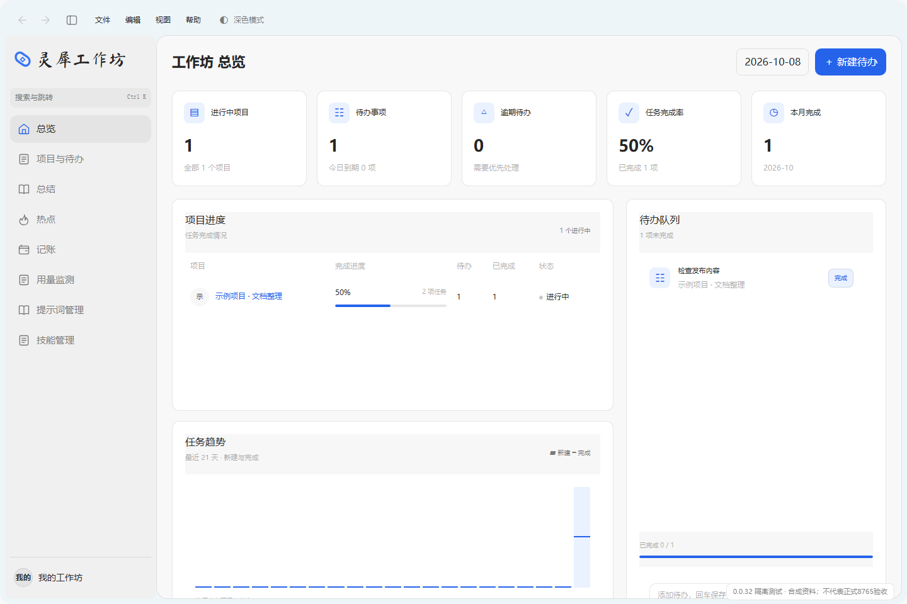
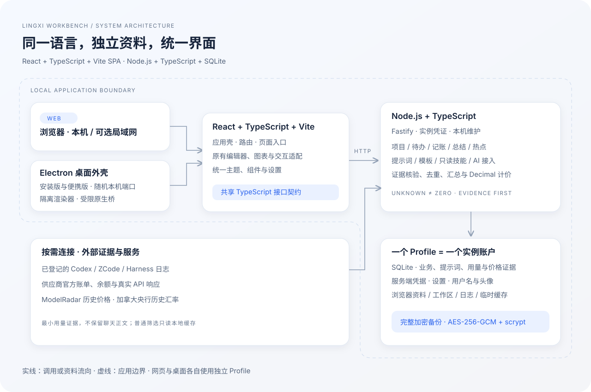

<div align="center">
  
  <h1>灵犀工作坊</h1>
  <p><em>把日常工作、AI 用量、提示词与本机技能放进一个个人工作台。</em></p>
  <a href="https://github.com/Ceeyu-iooi/Lingxi-Workspace/releases"></a>
  
  
  <a href="LICENSE"></a>
</div>

<p align="center"><a href="#安装">安装</a> · <a href="#功能特性">功能特性</a> · <a href="#app-数据">App 数据</a> · <a href="#从源码构建">从源码构建</a> · <a href="#工作原理">工作原理</a> · <a href="#设置">设置</a></p>

## 灵犀工作坊是什么？

一个以本机 Profile 为资料边界的个人工作台。网页版与 Windows 桌面版共享页面和业务服务；项目、待办、账单、提示词与用量证据集中管理。一个 Profile 就是一个实例账户，无需应用登录或注册，用户名与头像可以修改。

## 支持的工具与来源

| 来源 | 本机用量证据 | 余额、额度与账单 | 说明 |
|---|---|---|---|
| Codex | sessions / archived_sessions 的 token_count | 本机已授权账户的官方活动与额度 | 官方汇总与本机明细分开 |
| ZCode | CLI SQLite 与响应日志 | GLM 供应商接口能力 | 数据库证据优先，无法证明重叠时不相加 |
| DeepSeek Harness | JSONL / 多帧 Zstandard 会话日志 | DeepSeek 供应商接口能力 | 只保留最小用量证据 |
| API 供应商 | 真实 API 响应、授权历史接口或导入 | DeepSeek、GLM、OpenRouter、New API、Sub2API、硅基流动、Moonshot、MiniMax、LMU、自定义查询 | 各平台与 Key 的能力不同，不按余额反推 Token |

来源未返回、模型缺失、价格未知和查询失败不会被填成零。安装了某个 Agent，不代表获得它的全部历史。

## 0.0.37 的主要变化

- 设计规范作为唯一前端基准；浅深预览右侧读取实际规范代码，内置阅读界面可滚动、复制和返回。保留原来的主体宽度与留白。
- 模块按视觉行渐显；用量和Agent切换沿用数字滚动并重播；弹窗从触发处展开与缩回，减少动画设置可直接呈现结果。
- preview、规范和价格界面保留底层节点；返回恢复路由、筛选、Agent、滚动和侧栏状态。侧栏文字裁剪、字号/亮度控件及通知残留修复。
- 窗口按内容调整高度，底部主次操作靠左；价格表格使用紧凑行高、固定表头和内部滚动。桌面顶栏统一48px及页面窗口按钮，与遮罩统一分层。
- 安装/卸载源码统一24px圆角、边沿灰影、DPI和工作区居中，并依据标识实际可见边界调整视觉位置。安装包与许可资源已核验；原生 EXE 验收已按维护者要求取消，安装、升级、卸载及真实桌面交互均未标为通过。

## 界面展示



截图使用独立 Profile 的合成示例资料，不展示个人数据。v0.0.32已复查网页交互；v0.0.33修复桌面后台依赖漏包，并核对实际后台及原生驱动加载。本次原生EXE界面及安装、升级、卸载验收已按维护者要求取消，未标为通过。

应用采用浅青顶栏与侧栏、清晰白色主体及对应深色主题。侧栏收起保留 64px 图标栏并横向过渡，主体保持滚动位置。设置统一包含个人资料、外观、AI 服务、用量与实验、数据与备份、快捷键、关于；没有重复的“关于与更新”。保存反馈使用 SwipeToast。

[设计规范](design.md) · [浅色预览](frontend/app/preview.html) · [深色预览](frontend/app/preview-dark.html)

## 为什么用灵犀工作坊？

- 工作记录与 AI 使用证据放在同一个个人工作台，减少来回整理。
- 资料留在自己选择的位置，网页和桌面保持独立，不自动合并。
- Token、供应商实际账单与参考等价值分开，缺口有证据说明。
- 不同模块沿用统一主题、圆角、编辑与保存交互。

## 功能特性

| 模块 | 功能 |
|---|---|
| 总览与项目 | 项目、待办、进度、活动、趋势与月度总结 |
| 热点与记账 | 热点聚合、交易记录、账单导入和统计 |
| 用量监测 | 日志证据、供应商余额与账单、多 Key、日期与任意多模型筛选 |
| 历史参考计价 | ModelRadar 历史价格、加拿大央行历史汇率、USD/CNY、缺价与分项证据 |
| 提示词 | 分类、编辑、版本、导入导出、模板市场、按需 AI 评估与优化 |
| 本机技能 | 登记目录、只读扫描、搜索、来源和原文查看，不执行技能脚本 |
| Profile 与资料 | 可改用户名及头像、加密完整备份、受控迁移、资料空间统计 |

Agent 参考计价按工具独立选择，默认关闭。滑动确认后先准备已有记录的历史价格、汇率及双币种结果，再开启；失败和取消不误开启。普通筛选读取本地已采集资料和缓存，首次准备与热缓存查询是不同阶段。参考等价值不代表实际扣费、订阅实付或节省金额。独立 AI 对话与旧自动化执行入口已停用，保留提示词 AI 优化、评估与通知待办识别。

## 安装

在 [Releases](https://github.com/Ceeyu-iooi/Lingxi-Workspace/releases/latest) 下载 Windows x64 安装版。每次发布提供 Setup、更新元数据和 SHA-256 摘要；版本标题仅为版本号。便携版已停止构建、验收和发布。

| 包 | 使用方式 |
|---|---|
| `Lingxi-Workbench-版本-x64-Setup.exe` | 安装与升级；默认 Profile 跟随安装目录，可选择其他可写位置 |

桌面附带 Node 运行时，无需另外安装 Node 或 Python。卸载保留 Profile。当前未配置发布者代码签名，摘要校验与签名验证是两件事。

### 首次启动

选择或创建 Profile 资料位置，填写用户名，然后按需连接 Codex、ZCode、Harness 和供应商用量 Key；监测与 Key 都可稍后设置。引导中断后可继续，也可从“数据与备份”重新打开。新 Profile 默认浅色，后续尊重已保存主题。

“关于与更新”默认不自动检查、下载或安装。安装版按用户确认下载完整包并重启安装。已使用安装包在新后台和页面就绪后清理，尚待安装的新版本保留。0.0.28 及以前需先手动升级到支持检查更新的版本。

## 多设备与局域网访问

当前支持可选局域网访问同一个网页实例，不提供自动多设备 Profile 同步。默认仅监听本机。可在本机“数据与备份 → 局域网访问”保存范围并正常退出、重启后台，或设置 `WORKBENCH_HOST=0.0.0.0`。连接凭证要求由当前Profile的配置决定；取消凭证要求后，局域网设备直接进入工作坊。

也可在 Profile 的 `config/web-server.json` 写入 `{"host":"0.0.0.0"}`。环境变量优先，`WORKBENCH_PORT` 默认 8765。已有服务不会被启动入口擅自重启；如果无法连接，先核验实际监听与本机网络配置。

## App 数据

| 位置 | 内容 |
|---|---|
| `.profile.json` | 不可变 profileId、用户名与创建信息 |
| `data/storage/workbench.sqlite` | 业务、提示词、用量、价格证据及派生缓存 |
| `data/credentials/` | 服务端凭据，禁止公开分发 |
| `backups/` | 完整加密 `.lxprofile` 备份 |
| `config/`、`workspace/` | 设置、维护配置和工作区 |
| `browser/`、`logs/`、`runtime/`、`updates/` | 桌面浏览器资料、日志、生命周期状态与临时更新包 |

网页版默认使用源码目录的 `profile`；桌面默认使用程序目录的 `profile`，两者独立。桌面 Cookie、草稿及缓存在 Profile 的 `browser`，崩溃记录在 `runtime/crashes`，新安装不额外建立 AppData/Roaming 资料目录。旧账户结构不会自动迁成新版 Profile；在资料目录中发现旧结构时明确提示。

“数据与备份”包含业务、工作区、设置、用户名、头像与凭据的完整 Profile 口令加密备份；口令不保存在浏览器、日志或 URL 中，丢失后无法解密。恢复前生成加密预备份、核验并事务应用。备份排除更新包、浏览器临时缓存、日志及备份自身。不要直接复制正在写入的 SQLite；受控迁移会先停写、校验及原子切换，原副本保留至明确清理。任何系统恢复资料均不得作为公开附件上传。

## 从源码构建

需要 **Node.js 24 LTS** 与首次安装依赖时的网络。网页版无需 Electron、Python、私有仓库或 API Key。

```shell
npm ci
npm run build:web
npm start
```

打开 **http://127.0.0.1:8765/**。Windows 可运行 `start.bat`，它显示启动状态，后台身份与版本核验后打开浏览器。保留运行窗口，按 Ctrl+C 正常退出。即使从其他目录调用启动脚本，资料仍按该副本定位。

局域网监听可在资料设置中启用。当前 Profile 的 `config/web-server.json` 设置 `requireAccessToken: false` 时，局域网设备可直接访问；未设置时仍需要实例凭证。本机维护、更新安装与凭据配置接口继续仅允许本机使用。

```text
Lingxi-Workspace/
├── start.bat                       # Windows 快捷启动
├── src/server/                     # Node TypeScript 服务与业务
├── src/shared/                     # 共享接口和默认值
├── frontend/app/                   # React 页面入口
├── frontend/compat/                # 原有交互的兼容适配
├── frontend/application-assets.json# 第三方集成成品摘要
├── static/                         # 样式、字体、图表及组件成品
├── scripts/                        # 构建、启动与维护入口
├── docs/                           # 架构、资料边界与使用说明
├── profile/                        # 启动后产生的私有资料
└── .runtime/                       # 可重建构建与私有定位
```

Vite 构建到 `.runtime/web-ui`，Node 后端构建到 `.runtime/server`。开发前端热更新可运行 `npx vite --config vite.app.config.mts`，其 API 代理需要单独启动后端。正式网页与桌面均不启用开发 HMR；服务端修改需要重启，前端发布更新需要刷新或重启。

## 工作原理



React 管理应用壳、路由与页面入口，现有编辑器和图表通过兼容适配保留交互；新入口、共享契约和后端采用严格 TypeScript，兼容控制器尚未全面严格类型化。Fastify 提供本机 HTTP，SQLite 保存资料，Decimal 处理金额，Sharp 处理头像，YAML 与 Node Zstandard 支持技能结构和日志解码。

用量采集核验原始证据、去重与归属；累计值、缓存子集和推理子集不会重复相加。价格按 UTC 消费日期、汇率按上海日期取历史证据，最多沿用此前七日，不使用未来汇率。更多见[架构与资料流](docs/ARCHITECTURE.md)、[用量来源及限制](docs/USAGE.md)及[TOKEN_ACCOUNTING](TOKEN_ACCOUNTING.md)。图的表达参考 [C4 容器图](https://c4model.com/diagrams/container)，采用本项目自绘 SVG。

## 会话数据保留期

仅保留核验所需的最小用量证据、元数据与读取进度，不保留 Agent 聊天正文或附件。SQLite 使用整数关联、无损证据块与精确金额表示保存用量，迁移保留原库恢复基线；明细按需解压，日常使用增量派生与局部空间回收。本机业务与历史证据不会按固定天数自动删除；清理派生计价缓存不会删除真实消费、价格与汇率证据。日志原文在用户登记的外部目录，不随 Profile 迁移或清理。

## 设置

- 个人资料：用户名、头像上传与移除。
- 外观：浅色、深色、系统主题，强调色、字号、亮度、减少动画、菜单语言与办公/编程模式；预览、保存和放弃各自明确。
- AI 服务：服务商、模型、API 地址与 Key；仅可选 AI 操作需要凭据。
- 用量与实验：登记真实日志位置、采集开关、提示词自动保存及 AI 功能。
- 数据与备份：加密完整 Profile、恢复、空间统计、受控迁移与可选局域网。
- 快捷键：搜索、侧边栏与设置，支持不重复的 Ctrl/Meta 组合。

## 隐私

凭据仅留在服务端 Profile，不进入前端、普通提示词导出、日志或公开 Git；只在用户口令加密的完整 Profile 备份中携带。AI 内容仅在用户点击评估、优化或识别时发送到已配置服务，供应商查询仅访问所配置的平台，默认不跟随重定向。技能扫描仅限登记目录，不执行 SKILL.md 或脚本。

公开源码不包含个人路径、账户、密钥、真实用量截图、Agent 日志原文、内部验收回执或私有桌面构建工具。

## 常见问题

| 情况 | 处理方式 |
|---|---|
| 8765 被占用 | 核验已有服务身份，或明确指定其他端口，不连接未知程序 |
| Node / 依赖缺失 | 安装 Node.js 24 LTS，在该副本运行 `npm ci` |
| 组件摘要失败 | 获取对应版本成品，不从失效下载地址猜测替代组件 |
| 没有 Agent 用量 | 核验实际日志目录与来源状态，不生成不存在的历史 |
| 金额未知 | 检查模型归属、原始分项、历史价格与汇率缺口 |
| 更新失败 | 保留当前版本，检查网络、磁盘和摘要后重试，不覆盖运行中的程序 |

## Star 历史

[查看项目关注与贡献情况](https://github.com/Ceeyu-iooi/Lingxi-Workspace/stargazers)。

## 参与贡献

欢迎通过公开仓库 Issue 提交可复现的问题与界面建议，请使用合成资料和脱敏截图。修改应保留现有功能与统一交互，依照 TOKEN_ACCOUNTING 验证数值，不将网页通过或构建通过冒充原生验收。

## 致谢

感谢 React、Vite、Node.js、Fastify、SQLite 与相关开源依赖。安装器留白与设置布局参考 DeepSeek Harness；组件、字体、图标和来源见 [THIRD_PARTY_NOTICES](THIRD_PARTY_NOTICES.md)。README 与中文 Release 章节参考 [Token Monitor](https://github.com/Javis603/token-monitor/blob/main/README.zh-CN.md)，功能说明均按本项目实际范围编写。

## 许可证

项目采用 [CC BY-NC 4.0](LICENSE)。仓库携带应用内集成的组件 JS/CSS 成品及业务源码，付费第三方原文件不公开，默认构建不重新编译这些组件，也不依赖失效下载地址。成品摘要见 `frontend/application-assets.json`，对应许可见 `static/vendor/`；它们随应用提供，不是可独立销售或分发的组件库。


Codex 账户在明确授权后只读使用 Profile 或本机 Codex 的登录缓存，不改写全局凭据，也不内置官方登录入口。查询五小时和每周额度、Credits 与重置卡。Credit 单行保留两位小数，重置卡按张展示 SloshGauge 到期电池；字号与亮度使用 ScrubField。关于页独立卡片包含直接联网检查与校验下载，桌面版可确认安装。
