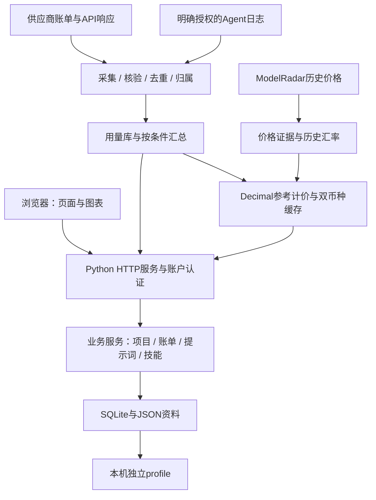

<div align="center">

# 灵犀工作坊

**把日常工作、AI 用量、提示词与本机技能放进一个个人工作台。**

[快速启动](#快速启动) · [功能](#功能) · [目录](#目录) · [技术架构](#技术架构) · [桌面版](#桌面版)

Python · SQLite · 本地资料 · 多账户隔离

</div>

## 功能

| 模块 | 能做什么 |
|---|---|
| 总览与项目 | 项目、待办、进度、活动及月度总结 |
| 热点与记账 | 热点聚合、交易记录、账单导入和统计 |
| 用量监测 | Codex、ZCode、DeepSeek Harness本机证据；API供应商余额、账单和响应用量；多Key及日期/模型筛选 |
| 参考计价 | ModelRadar历史价格与历史汇率；USD/CNY、缓存、缺价及证据说明 |
| 提示词 | 分类、编辑、版本、导入导出、模板市场及按需AI评估/优化 |
| 技能 | 登记本机目录、只读扫描、搜索、来源及原文查看 |
| 账户与资料 | 登录隔离、主题、字号、快捷键、账户备份与本机资料迁移 |

Token、账户余额和实际账单分别统计；参考等价值不是实际扣费。来源未返回、缺失模型、未知价格和网络失败不补成零。独立AI对话、旧自动化执行入口已停用。

## 快速启动

需要 **Python 3.12或更高版本**及首次安装依赖时的网络。普通使用无需Node.js、Electron、私有仓库或APIKey。

下载并解压[网页版源码](https://github.com/Ceeyu-iooi/lingxi-workbench-web)，在解压后的目录打开终端：

```shell
python scripts/install_web.py
python scripts/build_web.py
python -B run_web.py
```

浏览器打开 **http://127.0.0.1:8765/**，首次使用创建自己的账户。Windows也可运行 `start.bat`。从其他目录启动时可传入 `run_web.py` 完整路径，资料仍写入源码所在目录的 `profile`。

`build_web.py`检查源码和组件资源摘要，生成 `.runtime/web-build` 中的可运行副本；副本第一次启动建立自己的空profile，不导入原目录账户。

默认只监听本机。需要在可信局域网访问时，明确设置 `WORKBENCH_HOST=0.0.0.0`；端口可通过 `WORKBENCH_PORT`指定，默认8765。

## 目录

公开网页版的目录如下：

```text
lingxi-workbench-web/
├── run_web.py                 # 唯一根目录Python入口
├── start.bat                  # Windows快捷启动
├── src/workbench/             # HTTP服务、业务模块、存储及用量处理
├── static/                    # 页面、样式、字体、图表与应用组件资源
├── frontend/application-assets.json  # 集成组件成品的摘要与许可定位
├── scripts/                   # 网页依赖安装、构建与证据采集辅助
├── docs/                      # 当前架构与使用说明
├── profile/                   # 启动后产生的私有资料，不进Git
├── .runtime/                  # 依赖、可重建构建结果与私有定位，不进Git
└── README、LICENSE、VERSION等说明
```

profile统一包含账户数据库、`data`业务库与凭据、`backups`账户备份、`config`维护配置、`logs`日志和`runtime`生命周期状态。桌面profile另外包含浏览器资料、工作目录及`updates`更新缓存。

公开源码不包含个人账户、日志原文、密钥、真实用量截图、内部验收报告或桌面构建工具。

## 技术架构



后端使用Python标准库HTTP服务和SQLite；Zstandard、PyYAML、Pillow分别支持日志解码、结构化文件与头像处理。前端主体为HTML/CSS/JavaScript，局部交互采用React组件，图表直接在页面绘制。

普通筛选读取本地已采集资料和缓存，不为每次切换币种或模型重新请求价格网络。首次采集、首次计价准备和热缓存查询是不同阶段，不承诺首次计算瞬间完成。

更多说明见[架构与资料流](docs/ARCHITECTURE.md)和[用量来源及限制](docs/USAGE.md)。

## 配置与资料

- “设置 → AI服务”配置自己使用的服务；只有使用可选AI功能时才需要APIKey，凭据仅保存在服务端profile。
- “用量与实验”登记实际日志位置。安装Agent不等于获得完整历史；日志不可读时保留已核验资料并标记缺口。
- 供应商Key的能力取决于接口；余额不能反推出Token，普通推理Key不一定能查完整历史账单。
- Agent参考计价默认关闭。滑动确认后准备历史价格、汇率和双币种结果，失败不误开启。
- “数据与备份”中的导出和恢复仅作用于当前账户，不含凭据及他人资料。
- 全账户profile迁移属于本机维护：运行 `python -B run_web.py --manage` 打开短期授权入口，普通登录不能迁移其他人的资料。

复制正在写入的数据库可能遗漏WAL事务；请使用账户备份或受控profile迁移。系统恢复基线含恢复所需私有资料，禁止作为公开附件上传。

## 前端组件与许可

本仓库携带**应用内集成的组件JS/CSS成品**和网页业务源码。第三方组件原始文件不在公开源码中，默认网页构建不重新编译这些组件，也不依赖已失效的下载地址。

成品摘要见 `frontend/application-assets.json`，对应许可见 `static/vendor/`；它们作为本应用的一部分提供，不是可独立销售或分发的组件库。修改成品后需重新核验摘要，不能冒充可完整重建的第三方组件源码。

项目许可见[LICENSE](LICENSE)，字体、图标及第三方许可见[THIRD_PARTY_NOTICES](THIRD_PARTY_NOTICES.md)。

## 桌面版

[下载Windows桌面版](https://github.com/Ceeyu-iooi/lingxi-workbench-web/releases/latest)。桌面使用Electron窗口与自有随机本机端口后台，与8765网页资料保持独立。

安装时默认资料位置为安装目录的 `profile`，可另选可写目录；升级继续使用已有资料，卸载保留profile。0.0.28及以前需要手动安装一次0.0.29，之后在“设置 → 关于与更新”中手动检查、确认下载并重启安装。

优先差量下载，条件不满足时回退完整包；差量节省下载量，安装仍由完整安装器完成。更新缓存只保留当前基准和必要待安装文件。当前未配置发布者代码签名，摘要校验不等于发布者签名验证。

## 常见问题

| 情况 | 处理方式 |
|---|---|
| 8765已被占用 | 检查现有服务身份或明确设置其他端口，不仅凭端口存在连接未知程序 |
| Python依赖缺失 | 在该副本运行 `python scripts/install_web.py` |
| 组件摘要失败 | 获取对应版本的应用资源，不从失效registry猜测替代组件 |
| 没有Agent用量 | 登记实际日志目录，检查来源状态，不生成不存在的历史 |
| 金额未知 | 检查模型归属、原始分项、历史价格和汇率缺口 |
| 更新下载失败 | 保留当前版本，检查网络和磁盘后重试，不手工覆盖运行中的程序 |
